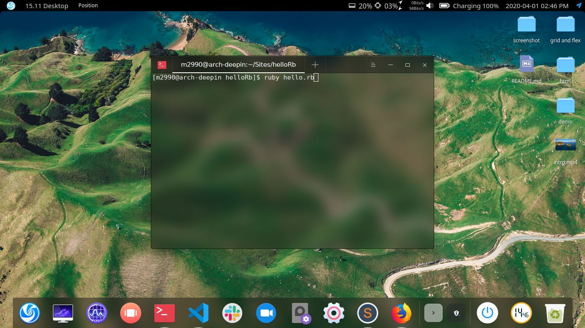

# My First Ruby Ever

>  Welcome to my first ever Ruby project. This is my version of a hello world with a inperational message to those who run the file, enjoy ;).

Additional description about the project and its features.

## Built With

- Ruby

## Getting Started

Clone directory and run with Ruby. Open terminal inside project folder and type "ruby hello.rb" and hit enter.

### Prerequisites

Ruby installed on your computer to be able to read this file. 

### Setup

If your using Arch you can do 

sudo pacman -S ruby --noconfirm 

to install. if your OS is diffrent check out the link bellow.

https://www.ruby-lang.org/en/downloads/

### Usage

Form me try it out. Ruby for all ;). 

### Run tests

Text editor, Terminal and Ruby.

## Authors

👤 **Miguel Angel Enciso Sanchez**

- Github: [@rootDEV2990](https://github.com/rootDEV2990)
- Twitter: [@m29902](https://twitter.com/m29902)
- Linkedin: [linkedin](https://www.linkedin.com/in/miguel-enciso-6474741a1/)
- Medium: [medium](https://medium.com/@website.dev)

## 🤝 Contributing

Contributions, issues and feature requests are welcome!

Feel free to check the [issues page](issues/).

## Show your support

Give a ⭐️ if you like this project!

Bitcoin donations accepted ;)
